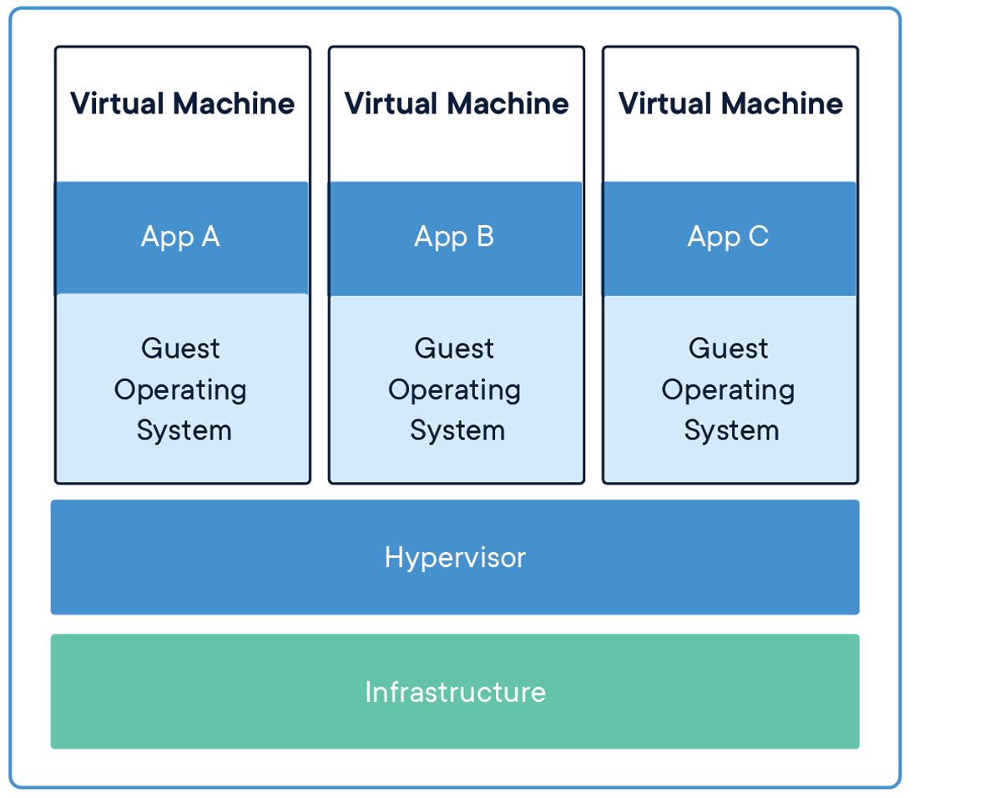

## O que é o Docker?

[Menu](../README.md)

Para entendermos o que é o Docker, primeiro é necessário falarmos sobre Máquina Virtual e Container.

Máquina virtual é um sistema operacional completo virtualizado. Isso inclui o kernel, uso do CPU, memória, placa de interface de rede, controladores USB e placas de som. O que resulta em maior consumo de recursos computacionais, já que você vai estar emulando um sistema operacional inteiro dentro da sua máquina.

Containers compartilham o kernel do sistema operacional hospedeiro e rodam como um processo isolado que contém todas as dependências necessárias para rodar sua aplicação. Containers ocupam menos espaço que uma máquina virtual, a imagem de um container normalmente pesa alguns MBs, enquanto um Sistema Operacional pesa GBs. Logo, você consegue rodar diversos containers usando menos hardware.

A Docker não criou a ideia de containers, ela faz o uso de recursos do kernel Linux chamado namespace e cgroups.

**Referência**
[Docker](https://www.docker.com/resources/what-container/)
[Docs Docker](https://docs.docker.com/get-started/docker-concepts/the-basics/what-is-a-container/)